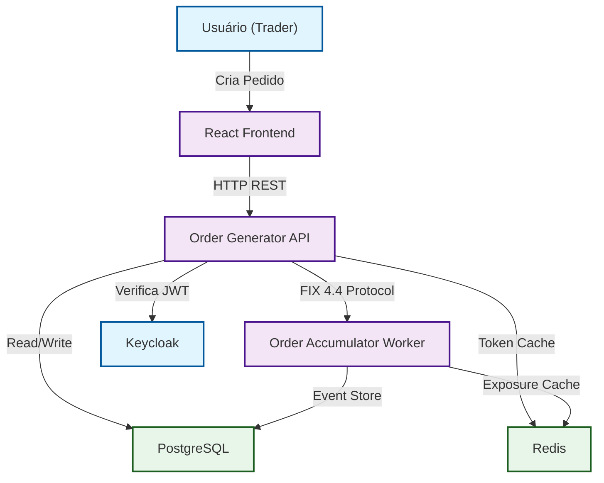
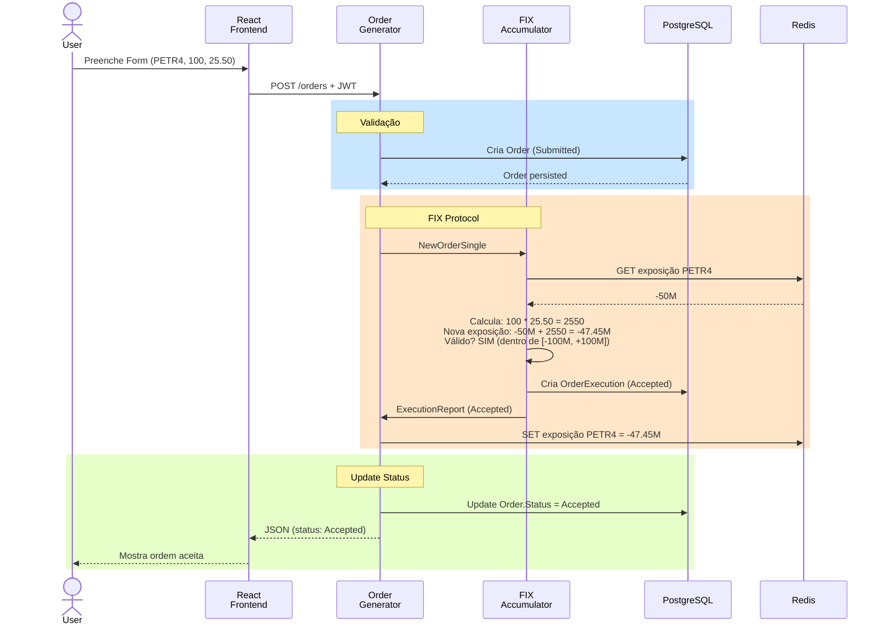
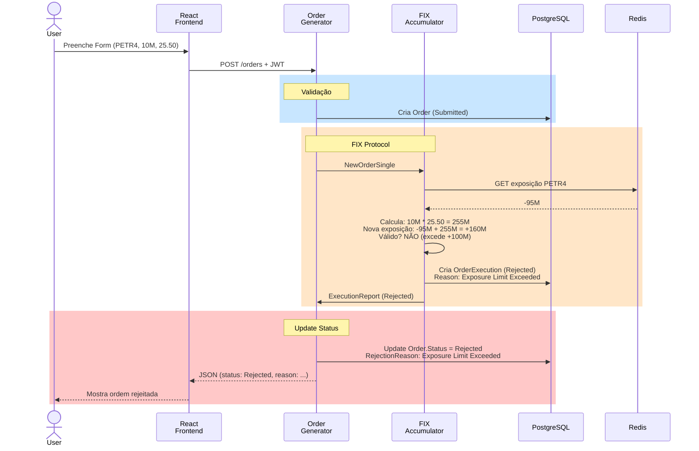

# Order Routing Sample | FIX Protocol (Financial Information eXchange)

[](https://dotnet.microsoft.com/)
[](https://react.dev/)
[](https://www.postgresql.org/)
[](https://www.docker.com/)
[](LICENSE)

## Descrição

Sistema de roteamento de pedidos para mercados de capitais utilizando protocolo FIX 4.4 com validação de exposição em tempo real. Implementado em arquitetura de Vertical Slices com padrão CQRS, demonstrando uma solução enterprise-grade para processamento de ordens de trading com garantias de consistência e rastreabilidade.

## Arquitetura

```
┌──────────────────────────────────────────────────────────────┐
│                    React Frontend                             │
│  (Browser - Port 5173)                                       │
├──────────────────────────────────────────────────────────────┤
│  - Order Form                                                 │
│  - Real-time Status Updates                                   │
│  - TypeScript + Vite                                          │
└──────────────────────────┬──────────────────────────────────┘
                           │ HTTP/REST
                           ↓
┌──────────────────────────────────────────────────────────────┐
│            Order Generator API (Port 5000)                    │
│  REST Endpoints + JWT Authentication                         │
├──────────────────────────────────────────────────────────────┤
│  - POST /orders (Create)                                      │
│  - GET /orders (List)                                         │
│  - GET /health (Health Check)                                 │
│                                                               │
│  Internals:                                                   │
│  - MediatR CQRS Pattern                                       │
│  - FluentValidation                                           │
│  - Repository Pattern                                         │
│  - OpenTelemetry Instrumentation                              │
│  - Serilog Structured Logging                                 │
└──────────────────────────┬──────────────────────────────────┘
                           │ FIX 4.4 Protocol
                           │ (TCP/Initiator)
                           ↓
┌──────────────────────────────────────────────────────────────┐
│         Order Accumulator Worker (Port 9000)                  │
│  FIX Protocol Server + Order Processing                      │
├──────────────────────────────────────────────────────────────┤
│  - FIX Acceptor (NewOrderSingle, ExecutionReport)            │
│  - Exposure Calculator                                        │
│  - Event Store Pattern                                        │
│  - Order Execution (Accept/Reject)                            │
│  - OpenTelemetry Instrumentation                              │
│  - Serilog Structured Logging                                 │
└──────────────┬──────────────────────────┬────────────────────┘
               │                          │
               ↓ (Read/Write)             ↓ (Cache)
        ┌─────────────┐          ┌─────────────────┐
        │ PostgreSQL  │          │     Redis       │
        │    (Port    │          │   (Port 6379)   │
        │   5432)     │          │                 │
        └─────────────┘          └─────────────────┘
```

## Requisitos

### Obrigatórios
- Docker 20.10+
- Docker Compose 2.0+

### Stack
**Backend:**
- .NET 8.0 (14 projetos com Vertical Slice Architecture)
- MediatR 11.1.0 (CQRS Pattern)
- Entity Framework Core 8.0
- PostgreSQL 15
- StackExchange.Redis 2.6
- QuickFIX/n 14.5.1 (FIX Protocol)
- OpenTelemetry 1.8.0 (Observability)
- Serilog 3.1.1 (Structured Logging)
- FluentValidation 11.9.2

**Frontend:**
- React 19.2
- TypeScript 6.0
- Vite 8.1
- Fetch API (HTTP Client)

**Infraestrutura:**
- Docker & Docker Compose
- PostgreSQL 15
- Redis 7
- Keycloak (autenticação)

## Como Rodar


### Pré-requisitos

```bash
docker --version
docker-compose --version
```

### Build e Execução

```bash
# 1. Clonar repositório
cd ~/fix-order-routing-sample

# 2. Build das imagens
cd .docker
docker-compose build

# 3. Iniciar todos os serviços
docker-compose up

# Aguarde mensagens de sucesso:
# fix-postgres is healthy
# fix-redis is healthy
# fix-generator-api | Now listening on: http://0.0.0.0:5000
# fix-accumulator-worker | FIX Acceptor session created
# fix-frontend | ✓ built in XXms
```

### URLs de Acesso

| Serviço | URL | Descrição |
|---------|-----|-----------|
| Frontend | http://localhost:5173 | React App |
| API | http://localhost:5000/api/v1 | REST Endpoints |
| Health | http://localhost:5000/api/v1/health | Status DB/Cache |
| Keycloak | http://localhost:8080 | Autenticação |

### Logs em Tempo Real (Terminal 2)

```bash
docker-compose -f .docker/docker-compose.yml logs -f fix-generator-api
```

## Documentação de Negócio

### Estados de Ordem

```
┌──────────┐
│Submitted │ Ordem recebida pela API
└────┬─────┘
     │ Enviada via FIX para Accumulator
     ↓
┌──────────┐
│ Pending  │ Validação de exposição em progresso
└────┬─────┘
     │
     ├─── Passou validação ──→ ┌──────────┐
     │                         │ Accepted │ ✓ Ordem aceita
     │                         └──────────┘
     │
     └─── Violou limite ──→ ┌──────────┐
                            │ Rejected │ ✗ Exposição excedida
                            └──────────┘
```

### Validações

**Exposição por Símbolo:**
- Limite: -100M a +100M por símbolo
- Cálculo: `(Quantidade * Preço) + Exposição Atual`
- Tipo: Long positivo (compra), Short negativo (venda)

**Validações de Pedido:**
- Símbolo: PETR4, VALE3, VIIA4
- Quantidade: >= 1
- Preço: > 0
- Lado: BUY ou SELL
- TimeInForce: GTC (Good-Till-Cancel)

### Fluxo Completo

1. Frontend: Usuário preenche formulário
2. API: Valida estrutura, autentica JWT, persiste Order (status: Submitted)
3. FIX Initiator: Envia NewOrderSingle para Accumulator
4. FIX Acceptor: Recebe ordem, calcula exposição
5. Decision: Compara exposição com limite
6. Execution: Cria OrderExecution (Accepted/Rejected)
7. FIX Initiator: Recebe ExecutionReport
8. API: Atualiza status e notifica Frontend
9. Frontend: Mostra status em tempo real

## Diagramas C4

### Contexto do Sistema



### Sequência: Criar Pedido



### Sequência: Rejeição por Exposição



## Endpoints da API

### Autenticação

```bash
POST /api/v1/token/debug
# Retorna: { "token": "eyJ..." }
# Nota: Endpoint de debug, sem autenticação requerida
```

### Pedidos

```bash
POST /api/v1/orders
Authorization: Bearer <token>
Content-Type: application/json

{
  "symbol": "PETR4",
  "quantity": 100,
  "price": 25.50,
  "side": "BUY",
  "orderType": "LIMIT",
  "timeInForce": "GTC"
}

# Response:
{
  "orderId": "550e8400-e29b-41d4-a716-446655440000",
  "symbol": "PETR4",
  "side": "BUY",
  "quantity": 100,
  "price": 25.50,
  "status": "Accepted",
  "createdAt": "2026-07-15T23:52:00Z",
  "rejectionReason": null
}
```

```bash
GET /api/v1/orders
Authorization: Bearer <token>

# Response:
{
  "data": [
    { "orderId": "...", "symbol": "PETR4", ... },
    { "orderId": "...", "symbol": "VALE3", ... }
  ],
  "pageNumber": 1,
  "pageSize": 50,
  "totalCount": 2
}
```

### Health Checks

```bash
GET /api/v1/health

# Response:
{
  "status": "Healthy",
  "checks": {
    "PostgreSQL": "Healthy",
    "Redis": "Healthy"
  }
}
```

## Observabilidade

### Structured Logging

Logs estruturados com correlação via OpenTelemetry:

```
[2026-07-15 23:52:00] INF Received NewOrderSingle: ClOrdID=ORD123
  TraceId: 0144975ac6ed77b18ff787b8b067bd22
  SpanId: 3d5de17006805895
  Symbol: PETR4
  Quantity: 100
  Price: 25.50
```

### Métricas e Traces

- Activities criadas por NewOrderSingle e ExecutionReport
- Instrumentação SQL (queries com duração)
- Instrumentação AspNetCore (endpoints com latência)
- Console Exporter para desenvolvimento

## Licença

Este projeto está licenciado sob a licença MIT - veja o arquivo [LICENSE](LICENSE) para detalhes.

## Autor

Desenvolvido como amostra de arquitetura em mercados de capitais com protocolo FIX.
